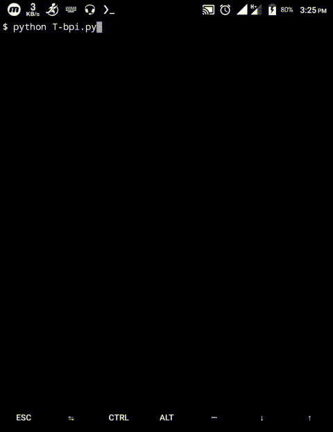

<!-- T-bpi -->

<p align="center">
 
</p>


<p align="center">Install all basic packages in termux. If you are looking for basic packages of termux then this is right tool for you. This tool is coded via python.</p>

##

### Features
- python
- python2
- python3
- python-dev
- php
- java
- git
- perl
- bash
- nano
- curl
> `openssl` `openssh` `wget` `clang`

> `nmap` `w3m` `hydra` `ruby` `macchanger` `host` `dnsutils` `coreutils`

> `termux-setup-storage`

##

### Installation
```
$ apt install git
$ apt install python
$ git clone https://github.com/Cyberi53/T-bpi
$ cd T-bpi
$ ls
$ chmod +x *
$ ls
$ python T-bpi.py
```
> It depends on your data connection. and it takes much longer to install.

### Dependencies

**`T-bpi`** requires following programs to run properly - 
- `apt install git`
- `apt install python`

> All the dependencies will be installed automatically when you run `T-bpi` for the first time.

### Required Commands
- rm -rf (uninstall tools name)

> More Commands via `github: https://github.com/Cyberi53/tmklCommands`

### Supported Platform
**`Termux`**

##

<h3 align="center">
:: How it works! ::
</h3>
<p align="center">

</p>

##

### Disclaimer :

##

### Special Thanks :

- [**AWWB**](https://facebook.com/awwbFoundation)
- [**jk -iTGuru**](https://github.com/jk-iTGuru)
- [**jkTECHDoctor**](https://github.com/jkTECHDoctor)
- [**Abdullah**](#)
- [**Emamul**](#)
- [**Freelancer Mustakin**](https://github.com/freelancermustakin)

##

### Donate!
> Donate a little money for helpless oppressed Muslims. The money you donate will only be used for Islam, InshaAllah.
- awwbFoundation (Donation)
  - `bKash: +8801944799794`
  - `Rocket: +8801944799794`
  - `Telegram: @contactAWWBfoundation`

> Or talk to Freelancer Mustakin, the founder of Cyber ​​I53. `via fb: www.facebook.com/freelancermustakin`

##

### Follow @Cyberi53
<a href="https://github.com/Cyberi53"></a>
<a href="https://facebook.com/Cyberi53"></a>
<a href="https://t.me/Cyber_i53"></a>
<a href="https://m.youtube.com/channel/UCoAUatLl3PQB-buaTMn8YJw"></a>
