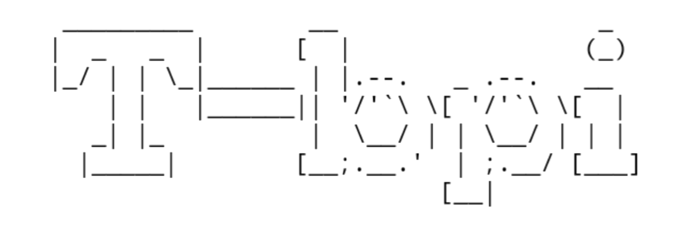

<!-- T-bpi -->

<p align="center">
 
</p>


<p align="center">Install all basic packages in termux. If you are looking for basic packages of termux then this is right tool for you. This tool is coded via python.</p>

##

### Features
- python
- python2
- python3
- python-dev
- php
- java
- git
- perl
- bash
- nano
- curl
> `openssl` `openssh` `wget` `clang`

> `nmap` `w3m` `hydra` `ruby` `macchanger` `host` `dnsutils` `coreutils`

> `termux-setup-storage`

##

### Installation
```
$ apt install git
$ apt install python
$ git clone https://github.com/Cyberi53/T-bpi
$ cd T-bpi
$ ls
$ chmod +x *
$ ls
$ python T-bpi.py
```

### A
